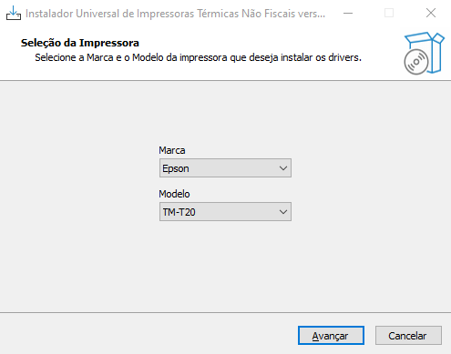

## Instalador Universal

Com o Instalador Universal, basta você selecionar a Marca e o Modelo da impressora que ele irá baixar e executar automaticamente o driver compatível com a versão do Windows onde está sendo executado.

[Baixar Instalador Universal v0.9.2](Output/Instalador_Universal_0.9.2.exe)
